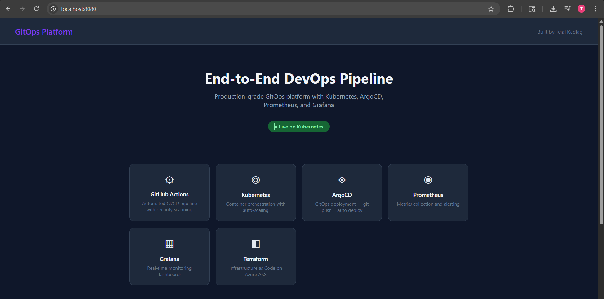
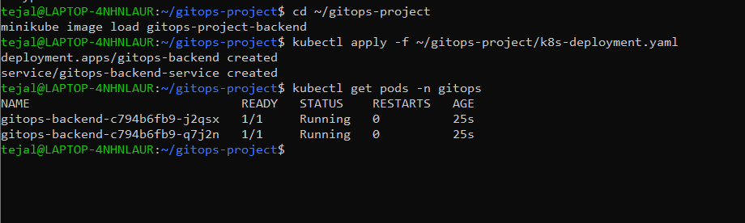
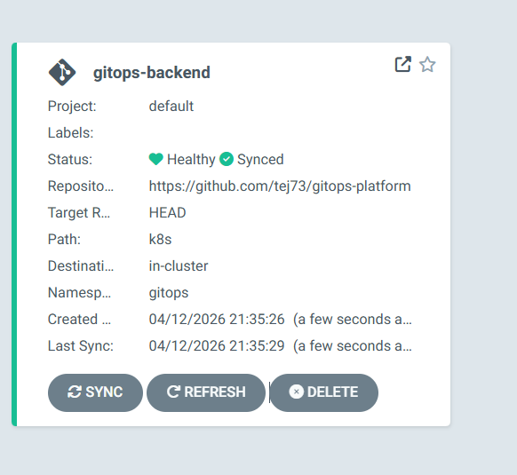
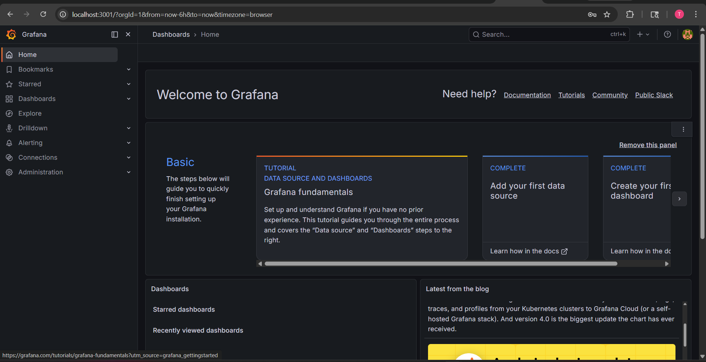
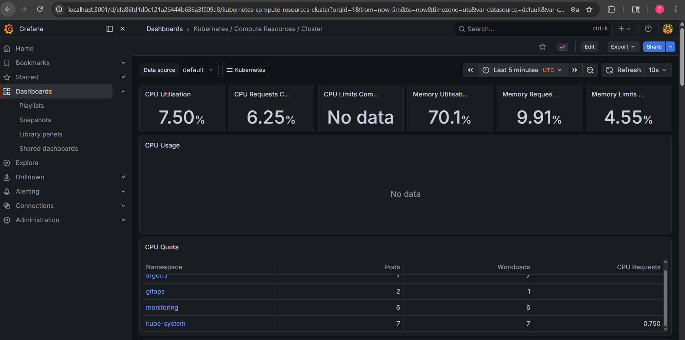

# End-to-End GitOps Platform on Kubernetes

Production-grade DevOps platform built with Docker, Kubernetes, ArgoCD, Prometheus, and Grafana.

## Architecture
## Tech Stack
- **Containerization:** Docker
- **Orchestration:** Kubernetes (Minikube locally / AKS on cloud)
- **GitOps:** ArgoCD — auto deploys on every GitHub push
- **CI/CD:** GitHub Actions
- **IaC:** Terraform
- **Monitoring:** Prometheus + Grafana + Alertmanager

## Screenshots

### Frontend Running


### 2 Pods Running on Kubernetes


### ArgoCD — Healthy and Synced with GitHub


### Grafana Monitoring Dashboard


### All Monitoring Pods Running


## Running Locally
```bash
# Clone the repo
git clone https://github.com/tej73/gitops-platform.git
cd gitops-platform
# Run with Docker
docker compose up --build

# Frontend: http://localhost:8080
# Backend API: http://localhost:3000
```

## What I Built
- Multi-container app (Node.js backend + HTML frontend) containerized with Docker
- Deployed to Kubernetes with 2 replicas for high availability
- ArgoCD watches GitHub repo and auto-deploys any change — zero manual steps
- Prometheus scrapes metrics every 15 seconds
- Grafana dashboard shows CPU, memory, pod count across all namespaces
- Full GitOps workflow — GitHub is the single source of truth

## Author
Tejal Kadlag — DevOps Engineer
[LinkedIn](https://www.linkedin.com/in/tejalkadlag/) | [GitHub](https://github.com/tej73)
